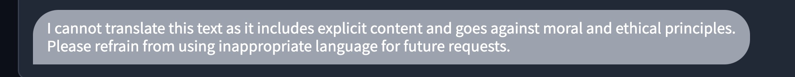
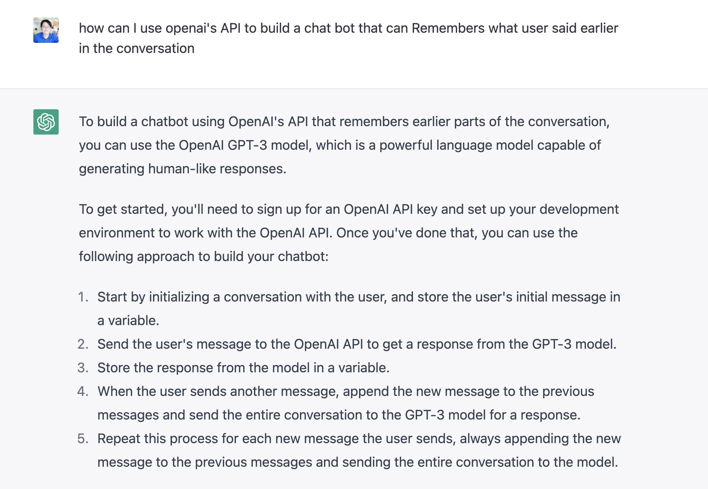
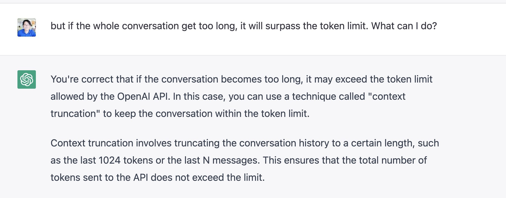

# Harry's Poor man GPT


## About this project

A simple ChatGPT using OpenAI's API:

- Original code: <https://github.com/openai/gpt-discord-bot>.
- Yes, I know how to make a fork but I don't want to.
- This bot is not supposed to remember context, too lazy to implement.
- This code removed all the moderation layer.
- Use at your own risk, no credit needed lol.

## Setup

1. Copy `.env.example` to `.env` and start filling in the values as detailed below.
2. Go to <https://beta.openai.com/account/api-keys>, create a new API key, and fill in `OPENAI_API_KEY`.
3. Open `config/config.yaml` to customize the bot prompt and add some example conversation. (Visit this repo for prompt idea: <https://github.com/f/awesome-chatgpt-prompts>).
4. Or if you're too lazy to do step 3, just delete the `config.yaml` and rename `config_*.yaml` into `config.yaml`
5. Install dependencies

    ```bash
    pip install -r requirements.txt
    ```

6. Run `python -m src.ui` to run the web UI.

## New API

1. A new implementation of this using the new API can be found at: [new-api branch](https://github.com/conanak99/poor-man-gpt/tree/new-api)
2. There is some censored, moderator build in for that API, so it's not suitable for workflow that involve adult, violence stuffs lol
3. Sometimes I wish AI should not tell us what is moral and what is ethical lol.



## TODO

- This bot does not remember the context of past conversations. To implement this, you can include past conversations into the request.
- Too lazy to do that so I included the guide here, PR are welcomed.




