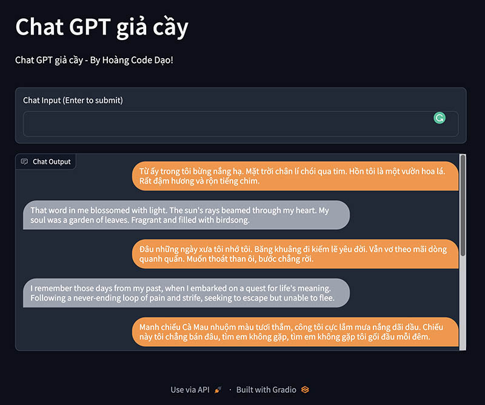

# Harry's Poor man GPT



## About this project

A simple ChatGPT using OpenAI's API:

- Original code: <https://github.com/openai/gpt-discord-bot>.
- Yes, I know how to make a fork but I don't want to.
- The bot should remember context now, will implement something if it got more than 4000 token
- This code removed all the moderation layer.
- Use at your own risk, no credit needed lol.

## Setup

1. Copy `.env.example` to `.env` and start filling in the values as detailed below.
2. Go to <https://beta.openai.com/account/api-keys>, create a new API key, and fill in `OPENAI_API_KEY`.
3. Open `config/config.yaml` to customize the bot prompt and add some example conversation. (Visit this repo for prompt idea: <https://github.com/f/awesome-chatgpt-prompts>).
4. Or if you're too lazy to do step 3, just delete the `config.yaml` and rename `config_*.yaml` into `config.yaml`
5. Install dependencies

    ```bash
    pip install -r requirements.txt
    ```

6. Run `python -m src.ui` to run the web UI.
